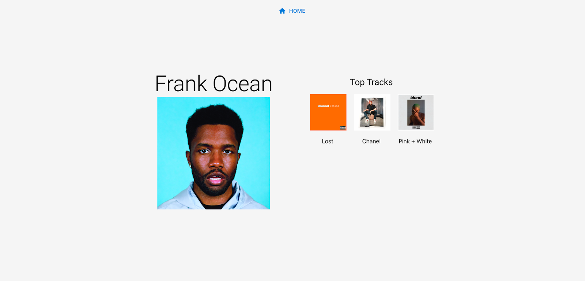

# MixMatched

The goal of this project is to use data from multiple music events to better equip consumers with the ability to make the best option at a price best suited to them.

MixMatched is a MERN stack web application that acts as a comparison tool for upcoming events.

It interfaces with the Spotify API for artist data and user inputted database for upcoming event information.

<head>
<title>MixMatched</title>
<meta charset="utf-8">
<link rel="stylesheet" type="text/css" href="./assets/theme.css">
<link rel="stylesheet" type="text/css" href="./assets/fonts/fonts.css">
<link rel="stylesheet" href="./assets/fonts/google-fonts/IBMPlexSans-Roboto.css">
<link rel="stylesheet" href="./assets/fonts/google-fonts/RobotoSlab.css">
<link rel="stylesheet" href="./assets/fonts/google-fonts/Caveat.css">
<link rel="stylesheet" href="./assets/fonts/google-fonts/AnonymousPro.css">
<link rel="stylesheet" href="./assets/fonts/google-fonts/Inconsolata.css">
</head>
<body>

<h3 class="nedit-heading editable-text paragraph indent-0" id="b2959951098_12" style="text-align:left;"><em>React Components</em></h3><h3 class="nedit-heading editable-text paragraph indent-0" id="b2959951098_39" style="text-align:left;">Navbar</h3>
The navigation bar (or navbar) provides navigation to other parts of the web application. It is located at the top of pages that require additional navigation, which means the navbar is not included in the Home page. All pages will have navigation options back to the Home page, but some will have additional options. 

 

<strong>Navigation bar directing to Home page</strong>

 

 

Below are two examples of navbars that have additional links to pages other than the Home page:

 

<strong>Admin page navigation dar directing to Home page and artist modification page</strong>

 

<strong>Admin page navigation dar directing to Home page and event modification page</strong>

 

<h3 class="nedit-heading editable-text paragraph indent-0" id="b2959951098_791" style="text-align:left;">Search</h3>
The search bar is a component that is only available on the Home page. 

<strong>Search bar default state</strong>

 

When a user interacts with the search bar, it will expand to show the available artists for selection. When artists are selected, the chips appear within the search bar to denote their selection. Users can click the “x” on the chips in order to delete them from the selection. Clicking out of the selection drop down and clicking “Search” will bring the user to the Results page. 

<strong>Search bar usage state</strong>

 

<h3 class="nedit-heading editable-text paragraph indent-0" id="b2959951098_1381" style="text-align:left;"><em>Views</em></h3><h3 class="nedit-heading editable-text paragraph indent-0" id="b2959951098_1397" style="text-align:left;">Home Page</h3>
The Home page is the main landing page when the user loads the site link. All of the other pages have redirection links within their navbar back to the Home page.

 

<strong>Home page</strong>

 

<h3 class="nedit-heading editable-text paragraph indent-0" id="b2959951098_1635" style="text-align:left;">Results Page</h3>
The Results page displays when the user submits their selection of artists for the search. There are 2 main components within the Results page: the results card section, and the chosen artist section. 

 

<strong>Results page</strong>

 

 

The results card section displays the top three match results resulting from the artist selection that was submitted. It displays each event’s name, location, cost, and the matching artist to that particular event.

 

As shown below, the first event has 3 matches and the second and third have 2 matches each. However the second event is listed first as its cost is less than the third’s.

 

<strong>Results card section</strong>

 

The chosen artist section displays the artists that were selected in the search on the Home page. Hovering over this section will reveal a blue rectangle surrounding the section. This section is scrollable in the event that more than 10 artists are selected.

 

<strong>Chosen artist section</strong>

 

<h3 class="nedit-heading editable-text paragraph indent-0" id="b2959951098_2722" style="text-align:left;">Artist Discovery Page</h3>
The artist discovery page will display information about a random selection of an artist using Spotify data. It can be accessed through the Home page through the “Explore Random Artist” button. It displays the artist’s name, picture, and top music tracks.

 

<strong>Artist Discovery Page</strong>

 

 
<h3 class="nedit-heading editable-text paragraph indent-0" id="b2959951098_3086" style="text-align:left;">Admin Tool</h3>
The admin tool can be accessed from the Home page through the small security icon located at the bottom of the page.

<strong>Home page highlighting access to admin login</strong>

 

 

After clicking on the security icon, the user will be redirected to the admin login page.

 

<strong>Admin Login</strong>

 

The admin login page is connected to a users database within MongoDB shown below. There are 2 admin users: John Doe and Tuffy Titan.

 

<strong>MongoDB users database</strong>

 

Their login credentials are encrypted on MongoDB, but for demonstration purposes, the following credentials can be used here <a href="https://mixmatched.herokuapp.com/login" target="_blank" rel="nofollow noopener"><u>https://mixmatched.herokuapp.com/login</u></a> 

 

<table class="table-component"><thead><tr><th class="table-head-start">

</th><th></th><th class="table-head-item" data-index="0" width="180">

A

</th><th class="table-head-item" data-index="1" width="180">

B

</th><th class="table-head-item" data-index="2" width="180">

C

</th></tr></thead><tbody><tr height="36"><td class="table-head-item" height="36" data-index="0">

1

</td><td></td><td colspan="1" rowspan="1" data-palette-bg-rgb="#42a5f5">
<strong>User</strong>

</td><td colspan="1" rowspan="1" data-palette-bg-rgb="#42a5f5">
<strong>Email</strong>

</td><td colspan="1" rowspan="1" data-palette-bg-rgb="#42a5f5">
<strong>Password</strong>

</td></tr><tr height="36"><td class="table-head-item" height="36" data-index="1">

2

</td><td></td><td colspan="1" rowspan="1">
John Doe

</td><td colspan="1" rowspan="1">
john@gmail.com

</td><td colspan="1" rowspan="1">
pass123

</td></tr><tr height="36"><td class="table-head-item" height="36" data-index="2">

3

</td><td></td><td colspan="1" rowspan="1">
Tuffy Titan

</td><td colspan="1" rowspan="1">
tuffy@gmail.com

</td><td colspan="1" rowspan="1">
pass123

</td></tr></tbody><tfoot><tr><td class="add-row"></td><td></td><td>

All:
3
<svg xmlns="http://www.w3.org/2000/svg" width="16" height="16" viewBox="0 0 16 16"><g fill="none" fill-rule="evenodd">         <path d="M0 0h16v16H0z"></path>         <path class="graphic" fill="#AEB7B8" d="M4 7h8l-4 4z"></path>     </g></svg>

</td><td>

All:
3
<svg xmlns="http://www.w3.org/2000/svg" width="16" height="16" viewBox="0 0 16 16"><g fill="none" fill-rule="evenodd">         <path d="M0 0h16v16H0z"></path>         <path class="graphic" fill="#AEB7B8" d="M4 7h8l-4 4z"></path>     </g></svg>

</td><td>

All:
3
<svg xmlns="http://www.w3.org/2000/svg" width="16" height="16" viewBox="0 0 16 16"><g fill="none" fill-rule="evenodd">         <path d="M0 0h16v16H0z"></path>         <path class="graphic" fill="#AEB7B8" d="M4 7h8l-4 4z"></path>     </g></svg>

</td></tr></tfoot></table>

 

 

Once an admin user is successfully authenticated, they are redirected to the event modification page.

 

<strong>Event Modification page</strong>

 

The event modification page comprises 2 sections: the event display section and the add music event section. 

 

The event display section is connected to the music events’ MongoDB database (shown in detail later in the data section) and displays information about each event item’s name, location, and price in alphabetical order by name.

 

<strong>Event display section</strong>

 

 

Below the event display section is the add music event section, which is also connected to MongoDB. Admin users are able to type in the event information into the input fields and this data will be stored into the MongoDB database as a new event. The UI should soon update and display the new event in the event display section.

 

<strong>Add music event section</strong>

 

Similar to the event modification page, the artist modification page comprises 2 sections: the artist display section and the add music artist section. 

 

The artist display section is connected to the artist MongoDB database (shown in detail later in the data section) and displays information about each artist’s name and Spotify ID in alphabetical order by artist name.

 

<strong>Artist Modification page</strong>

 

 

Since there is less data represented (only name and Spotify ID) and a higher number of artists than music events for this web application’s use case, the artist display section is presented in a scrollable table format.

 

<strong>Artist display section</strong>

 

 

Below the artist display section is the add artist section, which is also connected to MongoDB. Admin users are able to type in the artist information into the input fields and this data will be stored into the MongoDB database as a new artist. The UI should soon update and display the new artist in the artist display section.

 

<strong>Add music artist section</strong>

 

</body>
